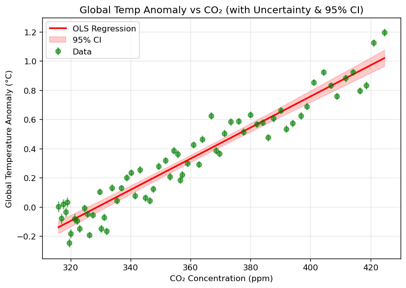
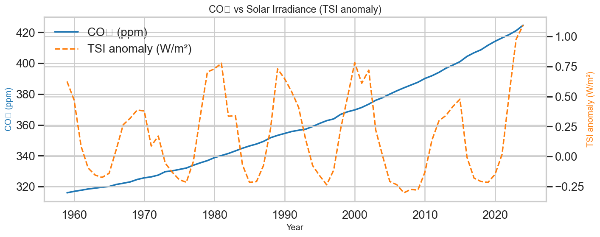
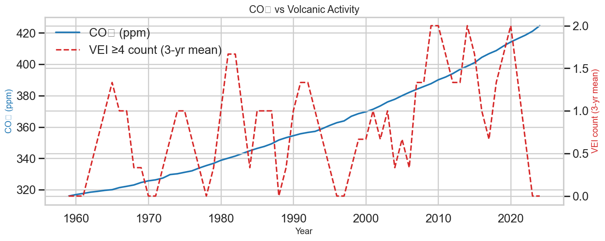
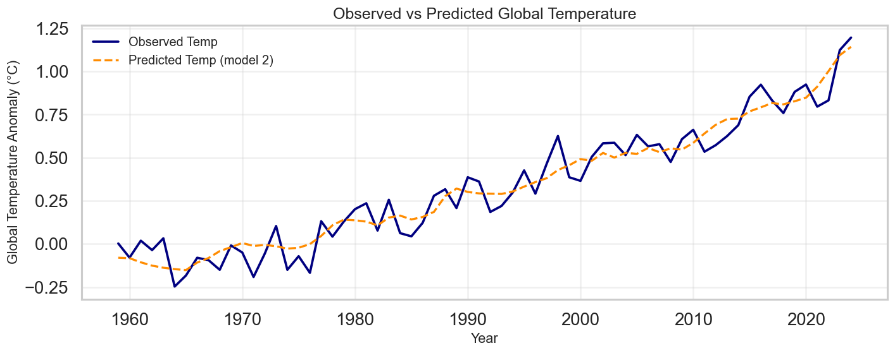
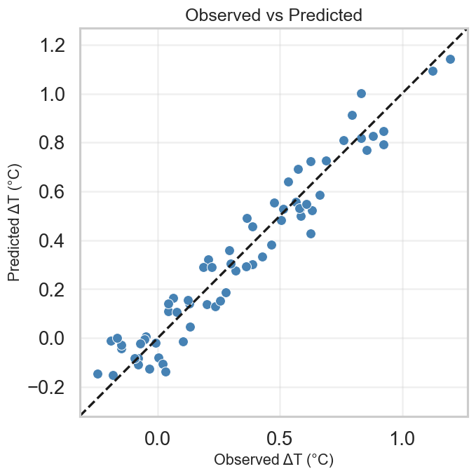

<p align="center">
  
</p>

<div align="center">
  <h1>Data driven analysis of Global Warming Causes</h1>
</div>


A reproducible, evidence-based analysis showing the link between rising **CO₂ levels** and **global temperature anomalies**, while testing and ruling out solar irradiance and volcanic aerosols as the main drivers.

---

## Table of Contents
1. [Abstract](#abstract)  
2. [Project Description](#project-description)  
   - [Key Components](#key-components)  
   - [Project Goals](#project-goals)  
3. [Datasets](#datasets)  
4. [Project Structure](#project-structure)  
5. [Installation](#installation)  
6. [Methodology](#methodology)  
7. [Results](#results)  
   - [Key Findings](#key-findings)  
8. [Future Work](#future-work)  
9. [Contributing](#contributing)  
10. [License](#license)  
11. [Contact](#contact)  

---

## Abstract

This project presents a reproducible, data-driven analysis quantifying the relationship between atmospheric CO₂ concentrations and global temperature anomalies, and evaluating the additional contributions of natural drivers such as solar irradiance and volcanic activity. Using merged land (Berkeley Earth) and ocean (HadSST4) temperature datasets, we construct a global anomaly series and assess driver influence through correlation analysis, linear regression, and ANOVA model comparison. The analysis quantifies each driver’s effect, formally tests whether natural factors significantly improve model performance, and provides statistical evidence that CO₂ is the dominant contributor to modern global warming, with solar and volcanic influences limited to short-term variability.

## Why this Project Matters
Climate change is one of the most pressing global challenges, yet public debate often questions the extent to which human activities are responsible. By rigorously comparing anthropogenic (CO₂) and natural (solar, volcanic) climate drivers using transparent, reproducible methods, this project provides clear statistical evidence to inform science communication, policy decisions, and climate education. The results not only quantify the role of CO₂ but also clarify the limited influence of natural variability, reinforcing the urgency of reducing greenhouse gas emissions.

## Project Description

Human activities, particularly fossil fuel combustion, have increased atmospheric CO₂ concentrations to levels unprecedented in at least 800,000 years. This study provides a **statistical demonstration** of the anthropogenic signal in recent warming, using transparent, reproducible methods and publicly available datasets.

Unlike many climate attribution studies relying on complex global climate models, this project applies open-source statistical tools and clear workflows that can be reproduced by researchers, educators, and the public.

### Key Components
- **Temperature Anomaly Construction** — Merged land (Berkeley Earth) and ocean (HadSST4) datasets with area weighting (29% land, 71% ocean) to build a consistent global anomaly series.  
- **CO₂–Temperature Analysis** — Found R² ≈ 0.92 since 1959, showing a strong correlation between CO₂ and global temperatures.  
- **Natural Driver Evaluation** — Confirmed that solar irradiance and volcanic activity contribute only short-term fluctuations without driving long-term warming trends.  
- **Statistical Modeling** — Applied OLS regression with HAC-robust errors and ANOVA to evaluate model fit and compare nested models.  
- **Visualization** — Produced comparative plots and diagnostic charts for transparency and reproducibility.

> The following sections detail the methodology, results, and statistical evidence supporting these conclusions.

### Project Goals
- Quantify the effect of CO₂ on global temperature anomalies.
- Evaluate whether natural forcings explain recent warming trends.
- Provide reproducible, open-source analysis for scientific communication.
### Workflow Overview


---

## Datasets

| Dataset | Source | Period | Notes |
|---------|--------|--------|-------|
| CO₂ Annual Mean | Mauna Loa Observatory | 1959–2024 | ±0.12 ppm uncertainty |
| Land Temp Anomalies | Berkeley Earth | 1750–2024 | Annual anomalies vs baseline |
| Ocean Temp Anomalies | HadSST4 | 1850–2024 | Sea surface temperature anomalies |
| Total Solar Irradiance | NOAA/PMOD | 1610–2024 | W/m², includes 11-year cycles |
| Aerosol Optical Depth | NASA GISS | 1850–2012 | Volcanic aerosol loading |
| Volcanic Eruption Index | Smithsonian GVP | -55,500–2025 | Severity of eruptions |

---

## Project Structure

```
climate_analysis/
├── data/ # Input datasets (raw & processed)
├── images/ # All exported plots for README & report
├── notebooks/
│ └── final_project2.ipynb # Main analysis notebook
├── reports/
│ └── final_project.pdf # Detailed report
├── requirements.txt
└── README.md
```

---

## Installation

### Prerequisites
- Python 3.10+
- pip
- git

### Steps
```bash
# Clone repository
git clone https://github.com/ACM40960/project-project-in-math-modelling-a-s.git
cd project-project-in-math-modelling-a-s

# Create virtual environment
python -m venv venv
source venv/bin/activate   # macOS/Linux
venv\Scripts\activate      # Windows

# Install dependencies
pip install -r requirements.txt
```
## Methodology
* Data Loading & Cleaning: Standardize formats, remove missing values, align year ranges.

* Global Temperature Series: Merge land & ocean anomalies with area weighting, propagate uncertainties.

* Driver Merging: Combine CO₂, TSI anomalies, volcanic activity metrics.

* Correlation Analysis: Pearson correlations between temperature and each driver.

* Regression Models:
  * Simple: Temp ~ CO₂
  * Multiple: Temp ~ CO₂ + TSI + VEI Use HAC-robust errors.

* Model Comparison: ANOVA to test added explanatory power of natural forcings.

* Diagnostics: Residual plots, QQ plots, Cook’s distance, VIF.
## Results:
1. Global Warming Trend — Land, Ocean, and Global

Key finding: Land areas have warmed almost twice as fast as oceans since 1850. The global average, calculated with area weighting, shows a steep acceleration in warming after the 1970s.<br>
2. CO₂ vs Global Temperature

Key finding: CO₂ explains ~92% of the variation in global temperatures since 1959. Regression shows a slope of ~0.0107 °C per ppm CO₂, indicating a ~1.07 °C rise for every 100 ppm increase.<br>
3. Role of Solar Irradiance

Key finding: Solar irradiance varies cyclically with ~11-year sunspot cycles but shows no long-term upward trend, ruling it out as the main driver of sustained warming.<br>
4. Role of Volcanic Activity

Key finding: Major volcanic eruptions cause short-term cooling, but volcanic activity has no consistent trend and cannot explain long-term warming.<br>
5. Model Accuracy — Observed vs Predicted

Key finding: Multiple regression (CO₂, solar, volcanic) achieves R² ≈ 0.936. Predictions closely match observed values, confirming CO₂ as the dominant predictor.<br>
6. Predicted vs Observed Scatter

Key finding: Data points cluster tightly around the 1:1 line, further validating the model’s accuracy.
## Robustness & Diagnostics
* Durbin–Watson ≈ 1.85 → little autocorrelation in residuals.

* Pagan p ≈ 0.81 → no strong heteroskedasticity.

* VIFs ≈ 1.0–1.02 → no multicollinearity issues.

* Max Cook’s distance ≈ 0.31 → no single point drives the result.

* Observed vs Predicted is close to 1:1 line → model captures the signal.

* Data-quality notes: Pre-1900 eruption records (raw VEI) are incomplete and include negative “dummy years” from catalogs; therefore, we rely on AOD (physical radiative impact) and restrict inference to modern decades (1959–2012).
## Limitations
*  linear models can’t capture all feedbacks or internal variability (ENSO, AMOC, etc.).

* Annual averaging smooths sub-annual signals and extremes.

* SI composites and AOD reconstructions have uncertainties; results are robust to these but not immune.

* We do not perform formal attribution with full climate models; this is a transparent statistical test, not a full detection-and-attribution study.
## Future Work
* Add ENSO/PDO/AMO indices as additional covariates.

* Try Bayesian fits and time-varying coefficients.

* Use forcings (W/m²) instead of raw indices and fit a physical energy-balance model.

* Extend AOD to the latest reconstructions and test the post-2012 period with volcanic forcing proxies.
## Contributing
Contributions are welcome!

* Fork the repository.

* Create a new branch.

* Commit your changes.

* Submit a pull request.

## License

This project is licensed under the MIT License — see the [LICENSE](LICENSE) file for details.

