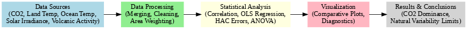
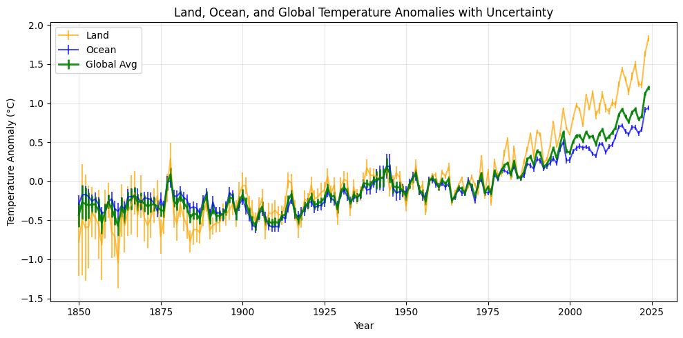
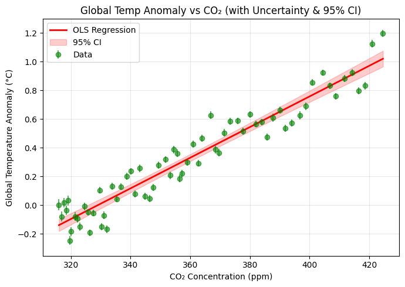
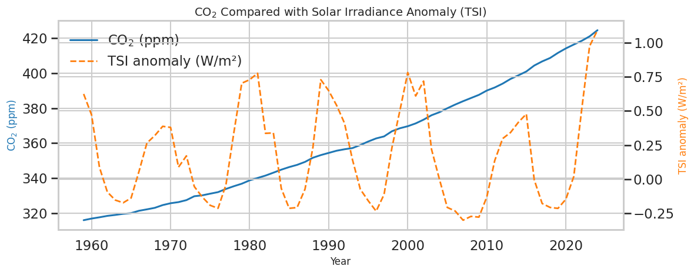
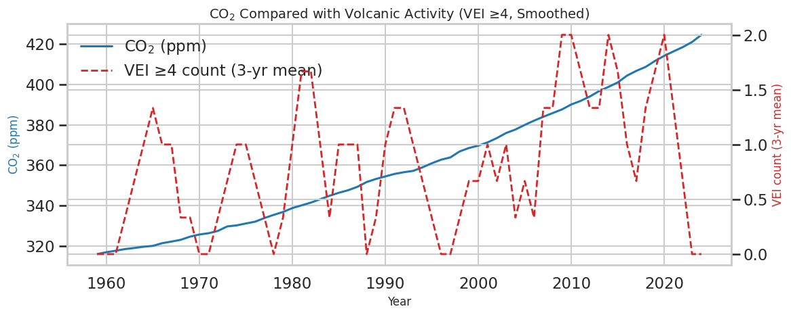
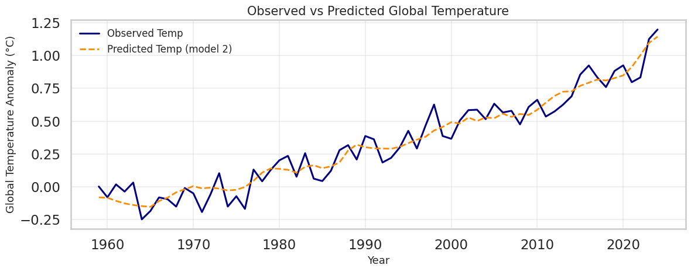
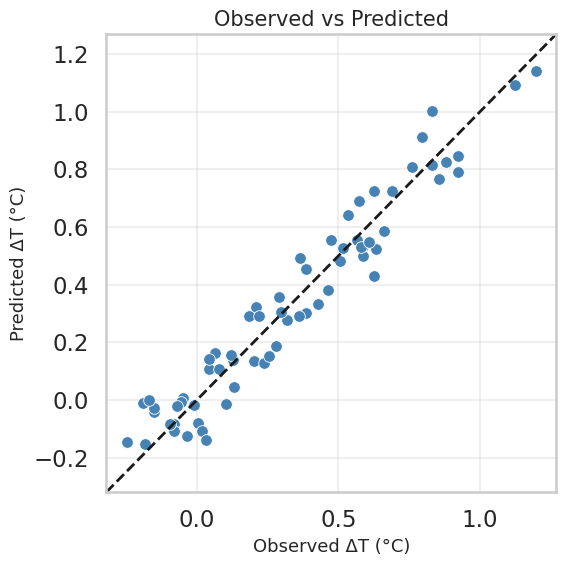
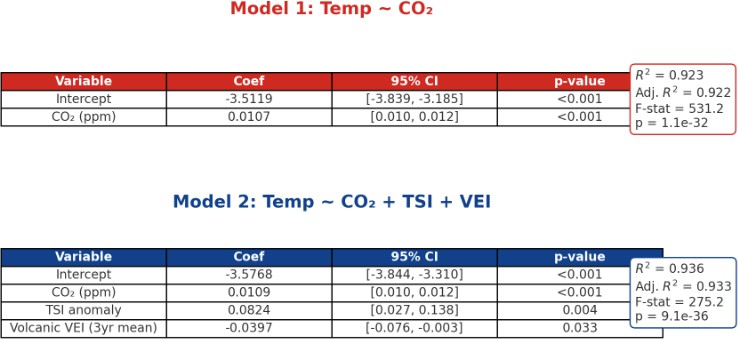
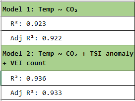

<p align="center">
  
</p>

<div align="center">
  <h1>Data driven analysis of Global Warming Causes</h1>
</div>


A reproducible, evidence-based analysis showing the link between rising **CO₂ levels** and **global temperature anomalies**, while testing and ruling out solar irradiance and volcanic aerosols as the main drivers.

---

## Table of Contents
1. [Abstract](#abstract)  
2. [Why This Project Matters](#why-this-project-matters)  
3. [Project Description](#project-description)  
   - [Key Components](#key-components)  
   - [Workflow Overview](#workflow-overview)  
   - [Project Goals](#project-goals)  
4. [Installation](#installation)  
5. [Datasets](#datasets)  
6. [Project Structure](#project-structure)  
7. [Methodology](#methodology)  
8. [Results](#results)  
   - [Global Warming Trend](#global-warming-trend-land-ocean-and-global)  
   - [CO₂ vs Global Temperature](#co₂-vs-global-temperature)  
   - [Role of Solar Irradiance](#role-of-solar-irradiance)  
   - [Role of Volcanic Activity](#role-of-volcanic-activity)  
   - [Model Accuracy](#model-accuracy--observed-vs-predicted)  
   - [Predicted vs Observed Scatter](#predicted-vs-observed-scatter)  
   - [Regression Analysis](#regression-analysis-coefficients--significance)  
   - [ANOVA Model Comparison](#anova-model-comparison)  
9. [Robustness & Diagnostics](#robustness--diagnostics)  
10. [Limitations](#limitations)  
11. [Future Work](#future-work)  
12. [Contributing](#contributing)  
13. [License](#license)  
14. [Contact](#contact)  

---

## Abstract

This project presents a reproducible, data-driven analysis quantifying the relationship between atmospheric CO₂ concentrations and global temperature anomalies, and evaluating the additional contributions of natural drivers such as solar irradiance and volcanic activity. Using merged land (Berkeley Earth) and ocean (HadSST4) temperature datasets, we construct a global anomaly series and assess driver influence through correlation analysis, linear regression, and ANOVA model comparison. The analysis quantifies each driver’s effect, formally tests whether natural factors significantly improve model performance, and provides statistical evidence that CO₂ is the dominant contributor to modern global warming, with solar and volcanic influences limited to short-term variability.

## Why this Project Matters
Climate change is one of the most pressing global challenges, yet public debate often questions the extent to which human activities are responsible. By rigorously comparing anthropogenic (CO₂) and natural (solar, volcanic) climate drivers using transparent, reproducible methods, this project provides clear statistical evidence to inform science communication, policy decisions, and climate education. The results not only quantify the role of CO₂ but also clarify the limited influence of natural variability, reinforcing the urgency of reducing greenhouse gas emissions.

## Project Description

Human activities, particularly fossil fuel combustion, have increased atmospheric CO₂ concentrations to levels unprecedented in at least 800,000 years. This study provides a **statistical demonstration** of the anthropogenic signal in recent warming, using transparent, reproducible methods and publicly available datasets.

Unlike many climate attribution studies relying on complex global climate models, this project applies open-source statistical tools and clear workflows that can be reproduced by researchers, educators, and the public.

### Key Components
- **Temperature Anomaly Construction** — Merged land (Berkeley Earth) and ocean (HadSST4) datasets with area weighting (29% land, 71% ocean) to build a consistent global anomaly series.  
- **CO₂–Temperature Analysis** — Found R² ≈ 0.92 since 1959, showing a strong correlation between CO₂ and global temperatures.  
- **Natural Driver Evaluation** — Confirmed that solar irradiance and volcanic activity contribute only short-term fluctuations without driving long-term warming trends.  
- **Statistical Modeling** — Applied OLS regression with HAC-robust errors and ANOVA to evaluate model fit and compare nested models.  
- **Visualization** — Produced comparative plots and diagnostic charts for transparency and reproducibility.

> The following sections detail the methodology, results, and statistical evidence supporting these conclusions.
> 
### Workflow Overview


### Project Goals
- Quantify the effect of CO₂ on global temperature anomalies.
- Evaluate whether natural forcings explain recent warming trends.
- Provide reproducible, open-source analysis for scientific communication.


---

## Project Structure

```
main/
├── data/ # Input datasets (raw & processed)
├── images/ # All exported plots for README & report
├── notebook/
│ └── final_project.ipynb # Main analysis notebook
├── report/
│ └── final_project.pdf # Detailed report
├── poster/
│ └── final_poster.pdf
├── requirements.txt
└── README.md
```

---

## Installation

Follow these steps to set up the project locally and reproduce the analysis.

### Prerequisites
Make sure you have the following installed:
- [Python 3.10+](https://www.python.org/downloads/)  
- [pip](https://pip.pypa.io/en/stable/installation/) (Python package installer)  
- [git](https://git-scm.com/book/en/v2/Getting-Started-Installing-Git)  
- (Optional but recommended) [virtualenv](https://docs.python.org/3/library/venv.html) or [conda](https://docs.conda.io/projects/conda/en/latest/index.html) for environment management  
- Jupyter Notebook or JupyterLab for running `.ipynb` files  

### Clone the repository
```bash
git clone https://github.com/ACM40960/project-project-in-math-modelling-a-s.git
cd project-project-in-math-modelling-a-s
```
### Set up a Virtual Environment
It is recommended to use a virtual environment to avoid dependency conflicts.
- For macOS/Linux
```bash
python -m venv venv
source venv/bin/activate
```
- For Windows/PowerShell
```bash
python -m venv venv
venv\Scripts\activate
```
### Install dependencies
All required packages are listed in requirements.txt.
```bash
pip install --upgrade pip
pip install -r requirements.txt
```
If you encounter time-axis warnings when using xarray, ensure cftime is installed:
```bash
pip install cftime
```
### Verify installation
Run the following to check that the required packages are available:
```bash
python -c "import pandas, numpy, matplotlib, seaborn, scipy, statsmodels, xarray, cftime; print('✅ All dependencies installed successfully')"
```
### Run the notebook
Once everything is installed, launch Jupyter and open the main analysis notebook:
```bash
jupyter notebook notebooks/final_project.ipynb
```
This will regenerate all figures present in the images/ folder and results into reports/.
### Export the notebook as PDF (optional)
If you want to produce a PDF version of the notebook with all outputs:
```bash
!pip install "nbconvert[webpdf]" playwright
!playwright install chromium
!jupyter nbconvert --to webpdf notebooks/final_project.ipynb
```
## Datasets

| Dataset | Source | Period | Notes |
|---------|--------|--------|-------|
| CO₂ Annual Mean | Mauna Loa Observatory | 1959–2024 | ±0.12 ppm uncertainty |
| Land Temp Anomalies | Berkeley Earth | 1750–2024 | Annual anomalies vs baseline |
| Ocean Temp Anomalies | HadSST4 | 1850–2024 | Sea surface temperature anomalies |
| Total Solar Irradiance | NOAA/PMOD | 1610–2024 | W/m², includes 11-year cycles |
| Aerosol Optical Depth | NASA GISS | 1850–2012 | Volcanic aerosol loading |
| Volcanic Eruption Index | Smithsonian GVP | -55,500–2025 | Severity of eruptions |

---
## Methodology
* Data Loading & Cleaning — All datasets (CO₂, temperature anomalies, solar irradiance, volcanic indices) were standardized to annual resolution, missing values handled, and year ranges aligned to create consistent time series.

* Global Temperature Series — Land (Berkeley Earth) and ocean (HadSST4) anomalies were merged using area-weighting (29% land, 71% ocean). Uncertainties were propagated to reflect confidence intervals in the global anomaly series.
* Driver Integration — CO₂ concentrations, solar irradiance anomalies, and volcanic activity metrics (AOD, VEI) were merged into a single driver panel aligned with the global temperature series.
* Exploratory Analysis — Pearson correlation coefficients quantified the strength and direction of relationships between temperature anomalies and each driver.
* Regression Modeling —
  * Simple model: Temperature anomalies regressed on CO₂ alone.
  * Multiple model: Temperature anomalies regressed on CO₂, solar irradiance, and volcanic activity, using HAC-robust standard errors to account for autocorrelation and heteroskedasticity.
* Model Comparison — ANOVA was used to formally test whether natural forcings (solar, volcanic) significantly improved explanatory power beyond CO₂ alone.
* Diagnostics: Residual plots, QQ plots, Cook’s distance, VIF.
## Results:
1. Global Warming Trend — Land, Ocean, and Global

Key finding: Land areas have warmed almost twice as fast as oceans since 1850. The global average, calculated with area weighting, shows a steep acceleration in warming after the 1970s.<br>
2. CO₂ vs Global Temperature

Key finding: CO₂ explains ~92% of the variation in global temperatures since 1959. Regression shows a slope of ~0.0107 °C per ppm CO₂, indicating a ~1.07 °C rise for every 100 ppm increase.<br>
3. Role of Solar Irradiance

Key finding: Solar irradiance varies cyclically with ~11-year sunspot cycles but shows no long-term upward trend, ruling it out as the main driver of sustained warming.<br>
4. Role of Volcanic Activity

Key finding: Major volcanic eruptions cause short-term cooling, but volcanic activity has no consistent trend and cannot explain long-term warming.<br>
5. Model Accuracy — Observed vs Predicted

Key finding: Multiple regression (CO₂, solar, volcanic) achieves R² ≈ 0.936. Predictions closely match observed values, confirming CO₂ as the dominant predictor.<br>
6. Predicted vs Observed Scatter

Key finding: Data points cluster tightly around the 1:1 line, further validating the model’s accuracy. <br>
7. Regression Analysis:
  
Key finding: CO₂ is by far the strongest predictor of global temperature anomalies. Volcanic activity has a statistically significant cooling effect, while solar irradiance shows only a weak, borderline influence.<br>
8. ANOVA Model Comparison: 
  
Key finding: Adding solar and volcanic variables produces only a marginal improvement (ΔR² ≈ 0.013), reinforcing that CO₂ is the dominant driver.

## Robustness & Diagnostics
* Durbin–Watson ≈ 1.85 → little autocorrelation in residuals.

* Pagan p ≈ 0.81 → no strong heteroskedasticity.

* VIFs ≈ 1.0–1.02 → no multicollinearity issues.

* Max Cook’s distance ≈ 0.31 → no single point drives the result.

* Observed vs Predicted is close to 1:1 line → model captures the signal.

* Data-quality notes: Pre-1900 eruption records (raw VEI) are incomplete and include negative “dummy years” from catalogs; therefore, we rely on AOD (physical radiative impact) and restrict inference to modern decades (1959–2012).
## Limitations
*  linear models can’t capture all feedbacks or internal variability (ENSO, AMOC, etc.).

* Annual averaging smooths sub-annual signals and extremes.

* SI composites and AOD reconstructions have uncertainties; results are robust to these but not immune.

* We do not perform formal attribution with full climate models; this is a transparent statistical test, not a full detection-and-attribution study.
## Future Work

- **Expand Drivers**: Add ENSO, PDO, and AMO indices to capture more of the natural variability.  
- **Improve Statistical Methods**: Apply Bayesian fits and allow for time-varying coefficients.  
- **Increase Physical Realism**: Use radiative forcings (W/m²) rather than raw indices and fit a simplified energy-balance model.  
- **Update Data Sources**: Extend AOD records with the latest reconstructions and evaluate volcanic influences in the post-2012 period.

## Contributing

Contributions are welcome! To contribute:

1. **Fork** the repository  
2. **Create** a new feature branch (`git checkout -b feature-name`)  
3. **Commit** your changes with clear messages  
4. **Push** to your branch and **open a Pull Request**

## License

This project is licensed under the MIT License — see the [LICENSE](LICENSE) file for details.
## Contact

For questions, suggestions, or feedback, please reach out:

- **Name**: [Shubham Santosh Salvi]  [Aditi Hemant Pokale]
- **Email**: [shubham.salvi@ucdconnect.ie]  [aditi.pokale@ucdconnect.ie]
